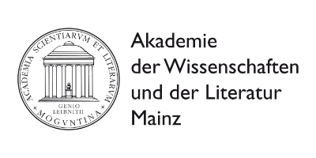

# OAD [ōd]


> Parse, validate and convert **O**pen**A**PI **D**efinitions in exist-db.

This is a wrapper around the [Swagger-Parser](https://github.com/swagger-api/swagger-parser) library.

## Installation

1. Download a pre-built XAR from the [releases](https://github.com/eeditiones/oad/releases/latest)
2. Install the package in your exist-db instance
3. Restart the database
4. Try
   ```xquery
   import module namespace oad="//eeditiones.org/ns/oad";

   oad:report('https://petstore3.swagger.io/api/v3/openapi.json')
   ```


## Usage

All module functions assume you have a API specification _stored_ in exist or available via HTTP. The spec can
be YAML or JSON. It allows to work with internal and external references.

In order for the Swagger-parser to be able to resolve external, relative references all of them need to be public.

If `$uri` is a DB-path (with or without `xmldb:`) **it will be converted to a REST-lookup first**. This means
the REST endpoint must be accessible.

### Example

If you have a specification stored in `/db/apps/myapp/api.json`

```json
{
  "openapi" : "3.0.2",
  "info" : { "title" : "my specification", "version": "1.0.0" },
  "paths" : {
    "/find" : {
      "get" : {
        "responses" : {
          "200" : {
            "description" : "result",
            "content" : {
              "text/plain" : {
                "schema" : {
                  "type" : "string"
                }
              }
            }
          }
        }
      }
    }
  }
}
```

Then

```xquery
import module namespace oad="//eeditiones.org/ns/oad";

oad:report('/db/apps/myapp/api.json')
```

will return

```xml
<info>
    <title>my specification</title>
    <description/>
    <version>1.0.0</version>
    <servers>
        <server url="/"/>
    </servers>
</info>
```

and

```xquery
import module namespace oad="//eeditiones.org/ns/oad";

oad:validate('/db/apps/myapp/api.json')
```

yields

```xquery
true()
```

## Functions

### `oad:validate($uri as xs:string) as xs:boolean`

Returns true() if the API definition is valid, false() otherwise (use `oad:report` to see the list of issues found).

### `oad:report($uri as xs:string) as document()`

Inspect the given definition and summarize the information into an XML document with an info-element at its root.
If the parser encounters issues these are listed as separate error-elements under errors. 

### `oad:flatten($uri as xs:string) as xs:string`

Flatten will inspect the given definition and extract schemas, parameters and such into components. They are then
replaced by references.

### `oad:resolve($uri as xs:string) as xs:string`

Resolves both internal and external references in an API definition. This will allow you to use it with Roaster, for 
example.

### `oad:convert($uri as xs:string, map(xs:string, *)) as xs:string`

The swiss-army knife of the available functions. Can convert definitions from one format to the other (JSON to YAML/
YAML to JSON) while _also_ allowing you to either resolve or flatten the definition.

The available options are listed in the table below:

| option   | description                 | allowed values            | default  |
|----------|-----------------------------|---------------------------|----------|
| `format` | serialization format        | `"json"`, `"yaml"`        | `"json"` | 
| `method` | what to do with references? | `"flatten"`, `"resolve""` | _none_   |

## Build

* Requirements
  * Java 8
  * Apache Maven 3.3+

```bash
mvn package
```

will create a `oad-<version>.xar` file in the `target/` sub-folder.

## Tests

There are no unit tests that will be executed when building the project.
The build package does include [xqsuite tests](src/main/xar-resources/xqsuite/oad-test.xqm) which test the integration
into exist-db works as intended.

You can call that as part of your development workflow by running

```bash
./run-integration-tests.sh
```

## Release

```bash
mvn release:prepare
```
```bash
mvn release:perform
```

## Sponsors

This package was made possible thanks to the contributions from following institutions

 &nbsp;  &nbsp; 
